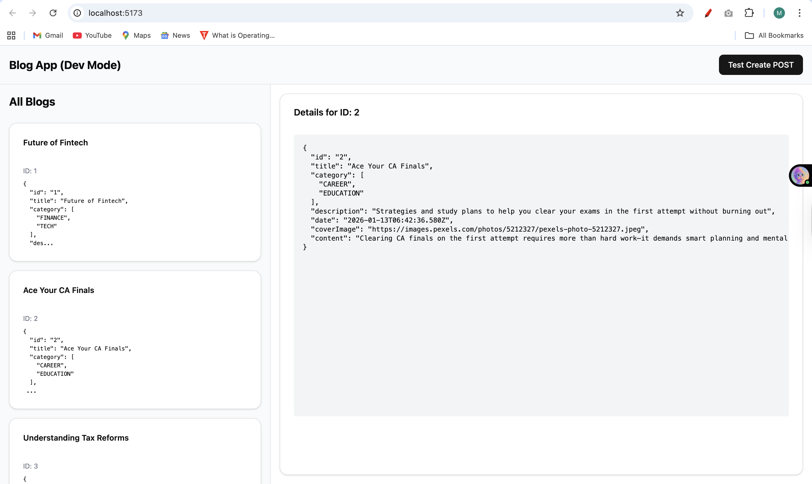
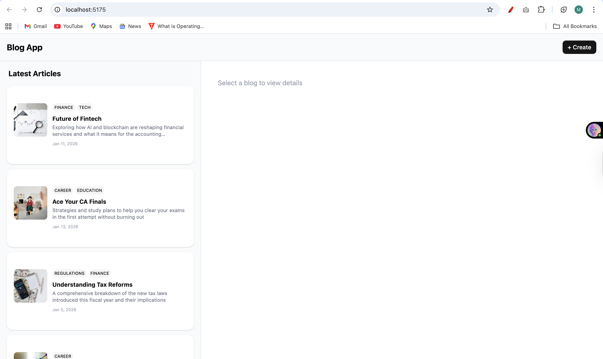
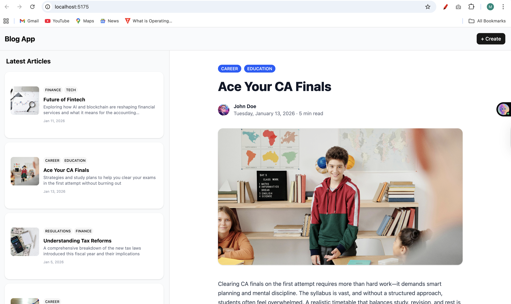
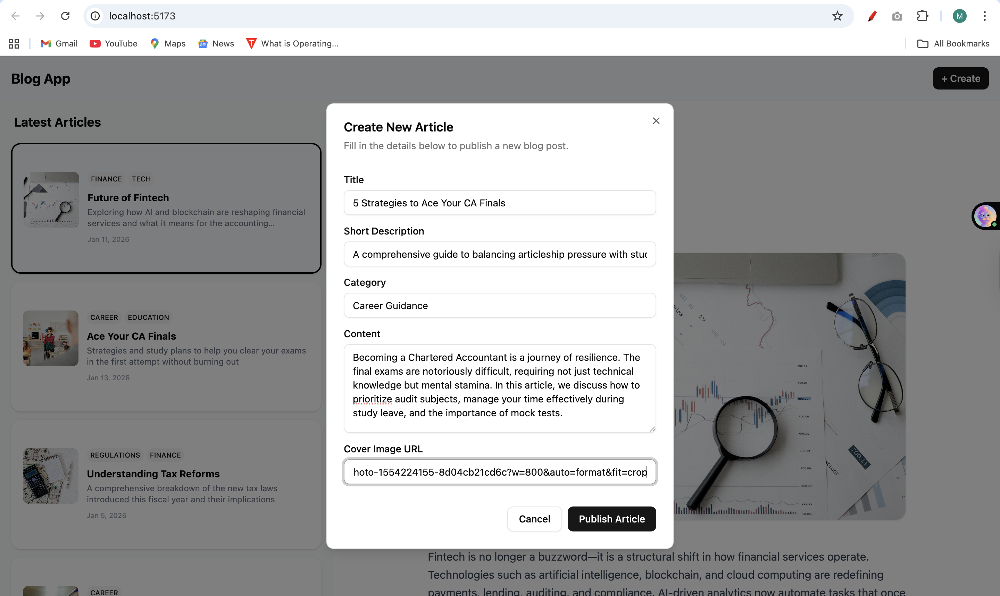
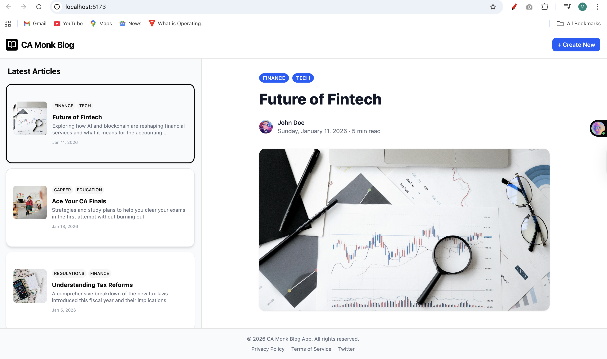

# 📱 Blog UI Assignment (Responsive)

A modern, responsive blog application built for the CA Monk assignment. This project demonstrates a master-detail layout, server-state management with TanStack Query, and a fully functional CRUD simulation using JSON Server.

## 🚀 Tech Stack

- **Frontend:** React (Vite), TypeScript, Tailwind CSS
- **UI Library:** ShadCN UI (Radix Primitives)
- **State Management:** TanStack Query (React Query)
- **Routing/Icons:** Lucide React
- **Backend Simulation:** JSON Server

---

# 📱 Blog UI Assignment (Responsive)

A modern, responsive blog application built for the CA Monk assignment. This project demonstrates a master-detail layout, server-state management with TanStack Query, and a fully functional CRUD simulation using JSON Server.

## 🚀 Tech Stack

- **Frontend:** React (Vite), TypeScript, Tailwind CSS
- **UI Library:** ShadCN UI (Radix Primitives)
- **State Management:** TanStack Query (React Query)
- **Routing/Icons:** Lucide React
- **Backend Simulation:** JSON Server

---

## 🛠️ How to Run Locally

This project requires **two terminals** running simultaneously (one for the React App, one for the Mock API).

### 1. Clone & Install
```bash
git clone <your-repo-url>
cd blog-ui-assignment
npm install
```


## 📸 Development Journey (Commit by Commit)

### Commit 1: Project Setup & ShadCN Integration
Initial setup with Vite, Tailwind, and ShadCN components configuration.


### Commit 2: Data Fetching (TanStack Query)
Implemented `useQuery` to fetch blogs from `json-server`. Handles Loading and Error states gracefully.



### Commit 3: Responsiveness (Mobile Drawer)
- **Desktop:** Split-screen layout (List | Details).
- **Mobile:** The List panel moves to a **ShadCN Bottom Drawer** for better UX.


### Commit 4: Blog List UI
Enhanced the list items with `Card` and `Badge` components, adding proper spacing and hover effects.



### Commit 5: Blog Detail View
Professional article layout with cover image, author avatar, separator lines, and typography styling.



### Commit 6: Create Blog Form
A Modal (`Dialog`) form to add new posts. Uses `useMutation` to update the server and automatically invalidate queries to refresh the list instantly.



### Commit 7: Header & Footer (Final Layout)
Added a clean Header with a "Create" action button and a standard Footer with copyright info.



## 📂 Project Structure

```text
src/
├── api/             # API calls (axios/fetch wrappers)
├── components/      # React components (BlogList, BlogDetail, Header, Footer)
│   └── ui/          # ShadCN UI components (Button, Card, Drawer, Dialog...)
├── App.tsx          # Main layout logic
├── main.tsx         # App entry point & QueryClientProvider
└── types.ts         # TypeScript interfaces
```

### 📝 License
This project is submitted as an assignment for CA Monk.
